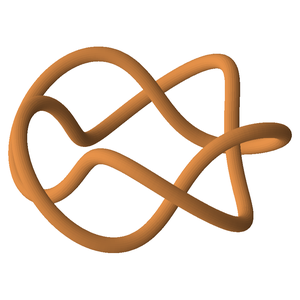
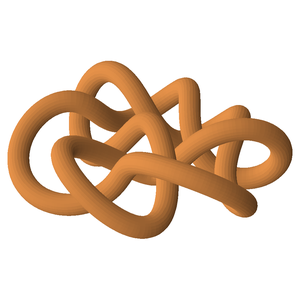
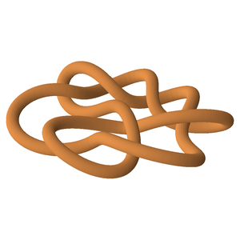
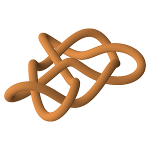
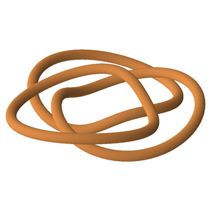
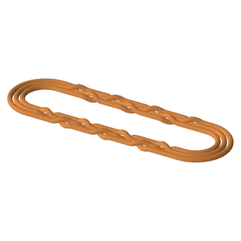

# Examples

Ready-made exports in [`examples/`](examples/), straight off real lamp builds and showcase pieces. Each JSON is a complete, self-describing design: import it into Fusion 360 with the [KnotImport script](fusion/KnotImport/) as-is, or regenerate/tweak it — every file embeds the exact command that made it (the `"command"` field), so a variation is one edited flag away.

Each entry lists its footprint, path length, the tube diameter the design was validated against, and how many printable pieces the connector spacing divides it into.

| | design | what it is |
|---|---|---|
|  | [`pentafoil.json`](examples/pentafoil.json)<br/>**5₁** | Relaxed pentafoil (tightness −0.6 rounds the lobes), deep crossings — a desk-lamp shape.<br/><sub>⌀300 × 100 mm · 2.0 m path · 16 mm tube</sub> |
|  | [`8_2_wall.json`](examples/8_2_wall.json)<br/>**8₂** | Wall lamp with LED strip frames (LEDs facing out), joints every ≤230 mm.<br/><sub>⌀500 × 150 mm · 3.7 m path · 40 mm tube · 16 pieces</sub> |
|  | [`8_2_wall_large.json`](examples/8_2_wall_large.json)<br/>**8₂** | The larger, flatter build of the same knot.<br/><sub>⌀700 × 100 mm · 4.5 m path · 40 mm tube · 20 pieces</sub> |
|  | [`8_4_wall.json`](examples/8_4_wall.json)<br/>**8₄** | A second 8-crossing wall lamp, gentler tightness, stiffer twist smoothing.<br/><sub>⌀700 × 130 mm · 4.3 m path · 40 mm tube · 19 pieces</sub> |
|  | [`borromean.json`](examples/borromean.json)<br/>**W(3,3)** | The Borromean rings — three interlocked loops, no two of which link; 4 connectors per ring.<br/><sub>⌀300 × 30 mm · 3 × 0.71 m path · 16 mm tube · 12 pieces</sub> |
|  | [`w37_racetrack.json`](examples/w37_racetrack.json)<br/>**W(3,7)** | A weaving knot laid out as a racetrack braid closure, crossings woven along both straights.<br/><sub>600 × 173 mm · 4.1 m path · 12 mm tube · 18 pieces</sub> |

## The commands

```bash
# pentafoil desk lamp
knotgen 5_1 --width 300 --depth 100 --tightness -0.6 --tube 16 --out examples/pentafoil.json

# 8_2 wall lamps (medium and large)
knotgen 8_2 --width 500 --depth 150 --tightness 0.3 --strip 20 --follow 0.5 \
    --twist-smooth 20 --light-dir down --connector-spacing 230 --tube 40 \
    --out examples/8_2_wall.json
knotgen 8_2 --width 700 --depth 100 --tightness 0.3 --strip 20 --follow 0.3 \
    --twist-smooth 3 --connector-spacing 230 --connector-offset 110 \
    --light-dir down --tube 40 --out examples/8_2_wall_large.json

# 8_4 wall lamp
knotgen 8_4 --width 700 --depth 130 --tightness 0.2 --strip 20 --follow 0.3 \
    --twist-smooth 30 --connector-spacing 230 --connector-offset 110 \
    --light-dir down --tube 40 --out examples/8_4_wall.json

# Borromean rings (a 3-component link)
knotgen "W(3,3)" --width 300 --depth 30 --strip 10 --follow 0.8 --tube 16 \
    --connectors 12 --out examples/borromean.json

# W(3,7) racetrack braid
knotgen "W(3,7)" --layout racetrack --braid-split 0.5 --width 600 --aspect 3 \
    --braid-fraction 0.9 --lane-gap 0.22 --depth 16 --strip 10 --follow 0.5 \
    --tube 12 --connector-spacing 230 --out examples/w37_racetrack.json
```

Prefix each with `uv run` when working from a checkout. Add `--preview` to any of them to explore the design in 3D first.

## What the numbers mean

- **tube** is the profile diameter the design was validated against: the pre-flight checks guarantee a round tube that size sweeps without self-intersection (a non-circular profile needs clearance for its *diagonal* — re-check with `knotgen check <file> --tube <diagonal>`).
- **pieces** come from `--connector-spacing` / `--connectors`: the Fusion script places your connector component at each joint, cuts the body into that many printable pieces, and engraves matching joint numbers on the mating ends.
