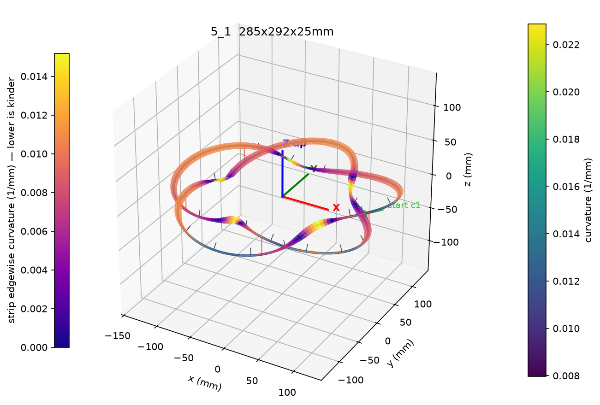
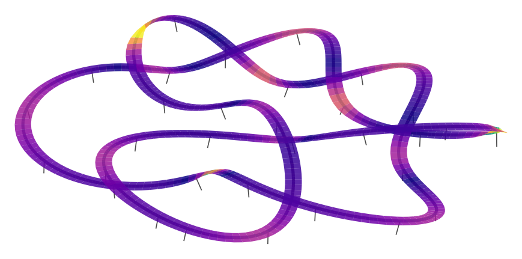
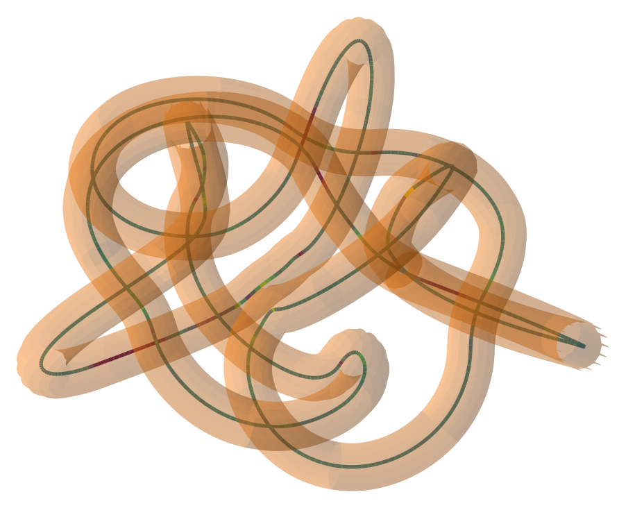
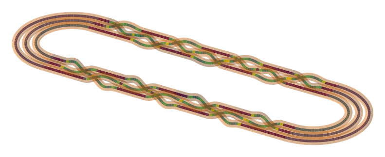

# knotgen

> **Note**: this codebase was almost entirely written by an AI (Anthropic's Claude), working under human direction — the design decisions, requirements and testing-in-anger are human, the code is machine-generated. Read it with that in mind. MIT licensed ([LICENSE](LICENSE)).

Generate mathematical knots and links as closed 3D curves, preview them, sanity-check them against a tube diameter, and import them into Fusion 360 as continuous sweepable paths.

Made for knot lamps: generate the knot here, sweep the LED-diffuser-channel profile in Fusion.

Coverage:
- **every prime knot to 11 crossings** — symmetrised embeddings for 3₁–8₂₁ (Fremlin), tightened "ideal" conformations for 9–11 crossings incl. the Hoste–Thistlethwaite tables (`9_35`, `10_124`, `11a42`, `11n34` / `K11n34`),
- **every prime link of the Thistlethwaite table** `L2a1` … `L11n459` — multi-component; each component becomes its own sweepable path,
- **parametric families**: torus knots/links `T(p,q)`, and weaving (Turk's head / rosette) knots `W(p,q)` — the alternating "woven" cousins of the torus knots. **p** = how many strands wide the woven band is; **q** = how many times the pattern repeats around the loop (= the lobe count and rotational symmetry). Crossings = q(p−1); gcd(p,q) separate loops (coprime = a single knot). `W(3,2)` = figure-eight, `W(3,3)` = Borromean rings, `W(3,4)` = 8₁₈, `W(3,5)` = 10₁₂₃; `--rho` sets lobe depth as for torus knots.

Aesthetics: Fremlin (≤8 crossings) and the parametric families are symmetric and 2.5D-flat by construction. The ideal 9–11-crossing/link data is an organic "pulled-rope" look — not symmetrised; negative `--tightness` doubles as a smoother for it.

## Gallery

<table>
<tr>
<td width="50%"><br/>
<b>Pentafoil (5₁)</b> with the LED-strip ribbon, coloured by edgewise strain<br/>
<code>knotgen 5_1 --width 300 --depth 25 --tightness -0.4 --strip 10 --follow 0.7</code></td>
<td width="50%"><br/>
<b>8₂</b> with strip frames solved for downward-facing LEDs<br/>
<code>knotgen 8_2 --width 300 --depth 30 --tightness 0.3 --strip 10 --follow 0.3 --light-dir down</code></td>
</tr>
<tr>
<td><br/>
<b>11a2</b> — a tightened "ideal" conformation, genuinely 3D (auto depth keeps its proportions), with a 24&nbsp;mm tube<br/>
<code>knotgen 11a2 --width 300 --tube 24</code></td>
<td><br/>
<b>W(3,7)</b> as a racetrack braid closure, crossings woven along both straights, 12&nbsp;mm tube preview<br/>
<code>knotgen "W(3,7)" --layout racetrack --braid-split 0.5 --width 600 --aspect 3 --braid-fraction 0.9 --lane-gap 0.22 --depth 16 --tube 12</code></td>
</tr>
</table>

## Quick start

```bash
# preview a pentafoil, 300 mm across, 25 mm of crossing depth
uv run knotgen 5_1 --width 300 --depth 25 --preview

# export for Fusion, checking that a 16 mm tube will sweep cleanly
uv run knotgen 5_1 --width 300 --depth 25 --tightness -0.4 --tube 16 --out pentafoil.json

# a 5-fold weaving knot, and the Borromean rings with strip + connector frames
uv run knotgen "W(3,5)" --width 300 --depth 25 --preview
uv run knotgen "W(3,3)" --width 300 --depth 30 --strip 10 --connectors 12 --out borromean.json

# what's available
uv run knotgen list -v                 # curated symmetric table + catalogue summary
uv run knotgen list --crossings 11     # e.g. all 552 11-crossing knots
uv run knotgen list --crossings 6 --links
```

Then in Fusion: **Utilities → Add-Ins → Scripts (Shift+S) → KnotImport** → pick the JSON. You get a new component with the knot as a single closed spline; sweep your profile along it (or accept the offered round-tube Pipe preview first).

## Folders & reproducibility

- `output/` — default landing spot: a bare `--out lamp.json` or `--save-png x.png` goes here. Git-ignored scratch space.
- `designs/` — move your keepers here; also git-ignored, so personal lamp designs stay out of the repo.
- `examples/` — shipped sample designs, documented in **[EXAMPLES.md](EXAMPLES.md)** — importable into Fusion as-is.
- Every export records the exact command that made it (`"command"` field) and all parsed options (`"cli_options"`), so any JSON can be regenerated or tweaked later even if you've forgotten the recipe.

## Commands

| command | what it does |
|---|---|
| `knotgen <name> [opts]` / `knotgen gen <name> [opts]` | generate, preview, export |
| `knotgen list [-v]` | table of available knots (`-v` adds symmetry order) |
| `knotgen check file.json --tube D` | re-run feasibility checks on an export |
| `knotgen preview file.json` | re-open the 3D viewer on an export |
| `knotgen identify <name-or-json>` | verify knot type via pyknotid (optional dep) |

Knot names are Rolfsen (`3_1`, `5_2`, `8_19`, ...), or `"T(p,q)"` for a raw torus knot.

### gen options

| flag | meaning |
|---|---|
| `--width MM` | diameter of the circumscribed circle in xy (default 300). Uniform in-plane scale — n-fold symmetry stays exact |
| `--breadth MM` | separate y extent — deliberately breaks the symmetry for oval layouts |
| `--depth MM` | z extent = how far strands separate at crossings. Default is auto: 25 mm for flat/2.5D embeddings; the fully-3D ideal conformations (9–11 crossings, links) keep their natural proportions instead — squashing those creates jagged near-cusps (the tool warns if you force it) |
| `--tightness T` | −1..1 aesthetic dial. Negative rounds corners off (relaxed rope), positive sharpens lobes into small loops (petal look). Implemented as symmetry-preserving harmonic reweighting |
| `--source` | `auto` (default), `fremlin`, or `torus` |
| `--variant` | Fremlin embedding variant (see `knotgen list`) — different symmetrisations of the same knot |
| `--rho R` | torus / weaving rosette: r/R in (0,1); bigger = deeper lobes |
| `--layout` | weaving knots only: `rosette` (round, q-fold symmetric, default) or `racetrack` — the braid-closure picture from the papers: a stadium shape with all crossings woven along one straight, nested non-crossing lanes around the rest |
| `--aspect A` | racetrack: straight length / stadium width (default 2) |
| `--braid-fraction F` | racetrack: how much of the straight the crossings occupy — small = tight woven patch in the middle, 1 = spread the full straight |
| `--lane-gap F` | racetrack: lane spacing (fraction of half-width, default auto) — smaller = gentler crossings, less lane clearance |
| `--braid-split F` | racetrack: move this fraction of the crossings to the other straight (0.5 = woven on both sides). Same knot either way — splitting the cyclic braid word around the closure is an isotopy — and halving the crossing density roughly doubles the bend radius |
| `--wall` | racetrack: wall-mount mode — under-strands stay flat at lane level, only over-strands arch up, and the whole path is shifted so the flat plane sits at z = 0. The z = 0 plane is the *path centerline*: author your profile accordingly (its back face below the sketch origin by the mounting offset), use `--light-dir up` so LEDs face away from the wall, and pair with `--braid-split 0.5` — one-sided arches climb the full depth in one go, so they're sharper than symmetric crossings |
| `--tube MM` | intended tube/profile diameter: refuses to export if it won't sweep, enables the Pipe preview in Fusion |
| `--out FILE` | write the JSON export |
| `--preview` / `--save-png FILE` | 3D view (curvature-coloured, crossing markers in red) |

### Pre-flight checks

Every `gen` prints:

- **min bend radius** — tightest curve radius; a tube of radius bigger than this self-intersects locally ("body would intersect itself" in Fusion),
- **min strand gap** — closest approach between different strands; the tube diameter must fit inside it,
- **max tube diameter** — the binding constraint of the two, with safety factors.

If `--tube` fails the check, nothing is exported and the message says which knob to turn (usually `--depth`, `--width`, or `--tightness`). Note that a non-circular profile needs clearance for its *diagonal*, not its width — re-check with `knotgen check file.json --tube <diagonal>`.

## LED strip surfaces

The strip bends in-plane and twists, but can't bend edgewise — so its ideal width direction is the curve's binormal, while "all light pointing one way" wants a fixed face direction. `--strip` computes orientation frames that blend the two:

```bash
# fully curvature-following (no edgewise strain, twists through crossings)
uv run knotgen 5_1 --width 300 --depth 25 --strip 10 --follow 1 --out lamp.json

# all LEDs facing down, minimal twist (hanging lamp)
uv run knotgen 5_1 --width 300 --depth 25 --strip 10 --follow 0 --light-dir down --out lamp.json

# in between, with stiffer twist smoothing
uv run knotgen 5_1 --width 300 --depth 25 --strip 10 --follow 0.6 --twist-smooth 20 --out lamp.json
```

| flag | meaning |
|---|---|
| `--strip MM` | strip width; enables everything below |
| `--follow F` | 1 = follow curvature (strip-friendly, twists), 0 = face the light direction (uniform light, edgewise strain), blends in between — weighted pointwise by confidence, so flat sections defer to the light target and tight corners defer to curvature |
| `--light-dir` | `up`, `down`, `out`, `in` (radial), or `x,y,z` |
| `--twist-smooth MM` | arc-length scale of twist-rate smoothing (0 = off, default 5) |
| `--frame-count N` | control lines exported for the editable Fusion mode (default 25) |

The preview shows the ribbon coloured by **edgewise curvature** (the kind the strip resists) with LED direction arrows; `gen` prints max twist (deg/cm), min edgewise bend radius, and min in-plane bend radius (compare with your strip's rated bend radius).

In Fusion, KnotImport then offers the surface two ways:

- **quick** — loft between the two precomputed edge splines, done;
- **editable** — your planes-and-lines workflow, automated: N construction planes along the path, each holding one line already rotated to the computed angle, lofted with the path as centerline. Drag any line afterwards and the loft follows.

## Connectors (Pattern Along Path replacement)

When a lamp body is chopped into printable pieces joined by a connector component, Fusion's Pattern Along Path can't match the twist of a guide-rail sweep. Instead, export exact frames and let the script place them:

```bash
# fixed count
uv run knotgen 5_1 --width 300 --depth 25 --strip 10 --connectors 8 --out lamp.json

# or a maximum piece length: count rounds UP, spacing shrinks to fit evenly
# (250 around a 600 mm loop -> 3 pieces of 200, never 250+250+100)
uv run knotgen 5_1 --width 300 --depth 25 --strip 10 --connector-spacing 250 --out lamp.json

# shift where the joins land with --connector-offset MM
```

KnotImport shows a single dialog: curve type, strip mode, pipe preview, a **profile selection** (composite profile sets work — select several regions), a **reference point selection**, and connector toggles (including a 180° flip if your connector faces backwards along the path).

**Alignment convention** (one reference drives both the sweep and the connectors): author the profile sketch *inside the connector component* and select a **reference point in that sketch** (e.g. its origin point). That point lands on the path; sketch-x goes across the strip (width) and sketch-y out of the LED face. The connector component is taken from the selected point's parent — no name typing — so the swept body and every placed connector line up from a single authored reference.

Connector copies land in their own root-level component (`<knot> connectors`), and all connector work is wrapped in a collapsed timeline group.

Two more dialog options (both keyed to the connector component):
- **Cut bodies** — select body/bodies in the connector component and they are Combine→Cut out of each swept piece at every connector position (tools kept). Leave empty for no cut.
- **Label anchor point** — select a sketch point in the connector component; its position (projected onto the joint's cross-section plane) places each joint number *within the cross-section*. One symmetric two-way extrude per joint stamps the number through the still-unsegmented body, so both mating ends carry it: reading **normally on one end, mirror-image on the other** — matching numbers assemble together, and the mirroring tells you which side of the joint an end is. A part between joints 4 and 5 reads "4" at one end and "5" at the other. **Set the engrave depth deeper than the connector socket's half-thickness**, or the socket cut removes the imprint (default 3 mm per side).
- **Scale factor** — dialog value (default 1) applied to all imported geometry (path, strip, connector/mount positions) but not to your profile, connector components, or label text — those stay physical size. Handy for late size tweaks without regenerating; preflight numbers in the JSON refer to scale 1, so rescale them mentally (clearances scale linearly).

The printed piece length between joins is reported at export time (and stored in the JSON under `connectors.per_component`). If Fusion's closed-path sweep glitches, the script automatically retries at 0.99999 of the path length — a known kernel quirk; the hairline gap is irrelevant for printing or can be patched.

**Sweep twist fidelity**: only the guide-rail sweeps (strip edge a/b) follow the computed strip frames. A **plain sweep ignores them** — Fusion uses its own minimal-twist frame, so the body won't match the strip surface, connectors or LED plan. The plain fallback is therefore *off by default* when a strip exists: enable "Allow plain-sweep fallback" in the dialog to force a body anyway, and the final report shouts a WARNING whenever a plain sweep was actually used.

## Mounting on a base

`--mount MM` (repeatable; `c2:450` for a link's second component) exports a full coordinate frame at that arc position, and KnotImport turns each into a **Joint Origin** (`mount 01`, …) — origin on the path, x along the path, z out of the LED face. Put a Joint Origin on your base where the knot should land, then one **rigid joint** between the two joint origins aligns everything: all three rotations come from the frames, no Move gymnastics, no hand-built planes. Fine-tune afterwards by editing either joint origin's angle/offset parameters, or regenerate with a different `--mount` position. Needs `--strip` (frames come from the strip solver).

## Fusion side

One-time install:

```bash
ln -s "$(pwd)/fusion/KnotImport" "$HOME/Library/Application Support/Autodesk/Autodesk Fusion 360/API/Scripts/KnotImport"
```

On import you choose:

- **exact** — a fixed NURBS spline (C2-smooth everywhere including the seam). Not editable in the sketch afterwards; regenerate with different parameters instead.
- **editable** — a fitted spline through ~60 arc-length-spaced points, closed. You can drag fit points later. Deviation from the exact curve is well under 0.1 mm.

The JSON carries both representations, so the choice is made at import time, not at generation time.

## How it works

Each knot is a short Fourier series per coordinate (the embeddings are David Fremlin's [symmetrised knots](https://david.fremlin.de/knots/index.htm), vendored in `src/knotgen/data/fremlin/`; torus knots are exact closed forms). That single representation gives:

- exact n-fold symmetry (a pentafoil is 5-fold to machine precision, and stays that way under all the styling controls),
- analytic derivatives → exact curvature for the bend-radius check,
- independent x/y/z scaling → the flat-with-depth-at-crossings look is just a z scale.

Exports contain arc-length-spaced fit points, an exact periodic cubic NURBS *and* its clamped equivalent (the Fusion script tries the best one first), dense points for other CAD tools, the Fourier coefficients themselves (so `check`/`preview` can reload exactly), and the pre-flight numbers.

## Development

```bash
uv run pytest                          # test suite
uv run python scripts/fetch_fremlin.py # refresh vendored knot data (network)
```

Roadmap ideas: broken-knot paths with parallel stand stubs (schema already supports multi-segment open paths), rectangular-frame layouts for woven knots, Boocher–Daigle–Hoste–Zheng Fourier-(1,1,2) parametric families, fully-3D embeddings.

## Attribution

- Symmetrised knot embeddings (3₁–8₂₁) from David Fremlin, [Knots and their symmetries](https://david.fremlin.de/knots/index.htm) — see `src/knotgen/data/fremlin/ATTRIBUTION.md`. The 8_5 Fourier series is computed from Fremlin's coordinate list (the site's own file is empty).
- Ideal (tightened) knot and link conformations by Brian Gilbert, [Knot Atlas: Ideal knots](https://katlas.org/wiki/Ideal_knots) — see `src/knotgen/data/ideal/ATTRIBUTION.md`.
- Weaving knots: Champanerkar–Kofman–Purcell [arXiv:1506.04139](https://arxiv.org/abs/1506.04139); Turk's head survey [arXiv:2409.20106](https://arxiv.org/abs/2409.20106).
